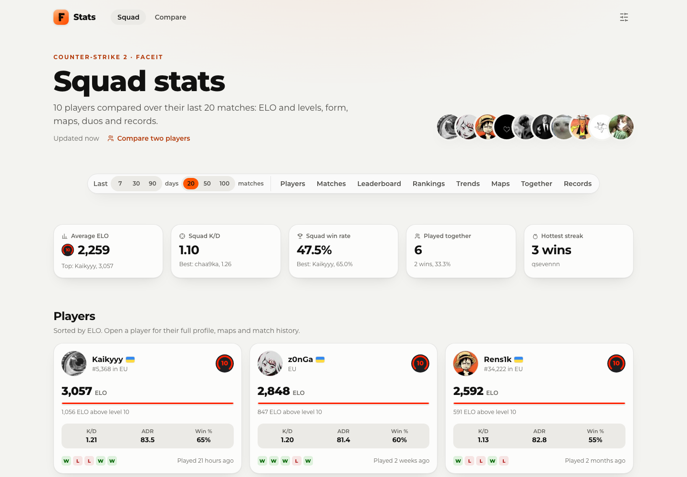
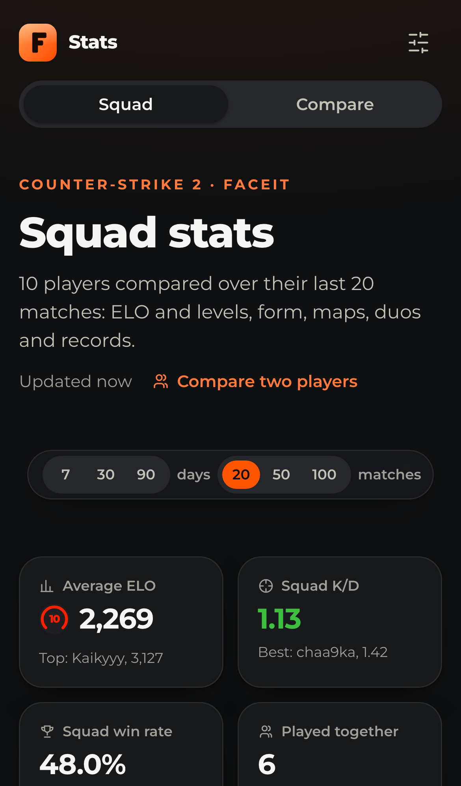
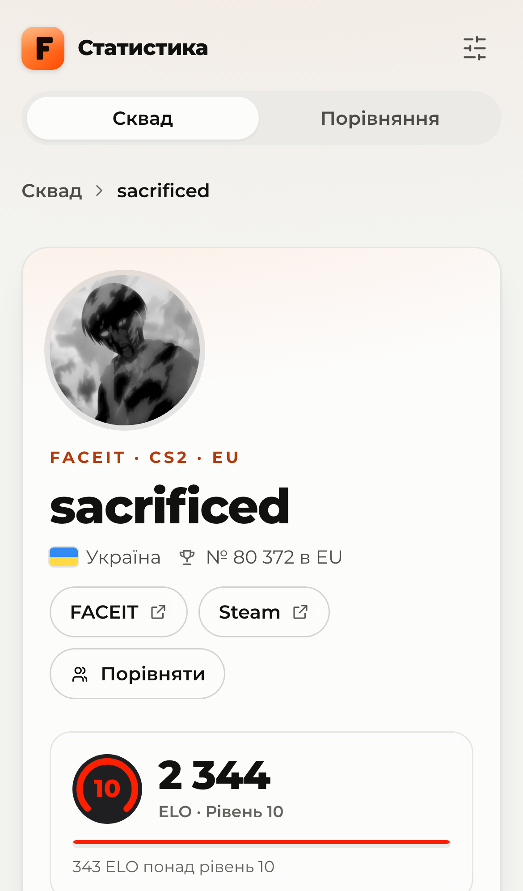
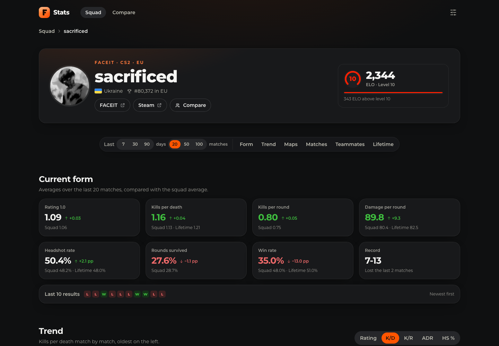
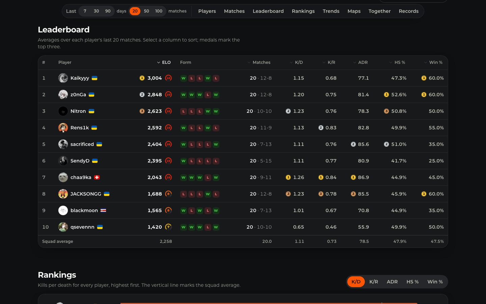
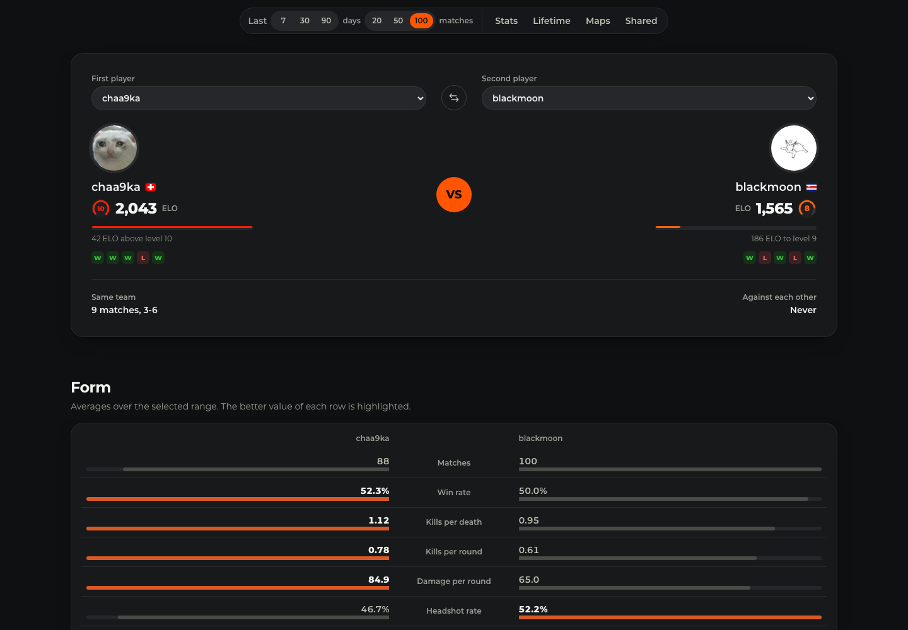

# 🔶 FACEIT Stats

[](https://github.com/sacrificed666/faceit-stats/actions/workflows/ci.yml)
[](https://github.com/sacrificed666/faceit-stats/actions/workflows/codeql.yml)

A dashboard that puts a squad of friends side by side on **FACEIT CS2**: ELO and levels, form, rating, K/D, ADR and headshots, map pools, the duos that queue together, the latest matches and the best single games, over the last days or the last matches of every player. Two players can be compared head to head on their own page. Built with Next.js 16, React 19 and TypeScript 7, prerendered and refreshed every five minutes, in ten languages, accessible, light or dark.

<picture>
  <source media="(prefers-color-scheme: dark)" srcset="./docs/images/desktop-dark.png" />
  
</picture>

## ✨ Highlights

- 🧑‍🤝‍🧑 **Squad overview**: average ELO, squad K/D and win rate, matches played together and the hottest streak at a glance
- 🃏 **Player cards**: level badge, ELO with the progress to the next level, region ranking, rating, K/D, ADR, win rate, last five results and when they last played
- ⭐ **Rating 1.0 and survival**: an HLTV 1.0 rating and the share of rounds survived for every match, calculated from the FACEIT statistics
- 🚦 **Highlighted numbers**: good values in green and weak ones in red, with the same thresholds in every card, table and chart
- 🕹️ **Recent matches**: one compact feed for the whole squad with map pictures, where a match played together appears once with everyone who played
- 🏆 **Leaderboard**: every player and metric in one sortable table, with medals for the top three of each column
- 📊 **Rankings**: ranked bars for rating, K/D, K/R, ADR, headshots or win rate against the squad average
- 📈 **Trends**: one small chart per player on a shared scale, with a five-match rolling average
- 🗺️ **Map pool**: a heatmap of win rate, K/D or picks for every player and map with the map pictures, plus the whole squad
- 🤝 **Playing together**: duos and lineups detected from shared match ids, with their win rates
- 🏅 **Records**: best rating, most kills, highest ADR, best K/D, headshot machine, MVPs, the longest win streak and the ace club
- 👤 **Player pages**: current form against the squad, a trend chart, maps next to their all-time numbers, a filterable match history with ratings and FACEIT match rooms, teammates, lifetime and playstyle statistics
- ⚔️ **Compare**: two players side by side with form, lifetime numbers, maps and every match they played together or against each other
- 🎚️ **One range for everything**: the last 7, 30 or 90 days, or the last 20, 50 or 100 matches, kept in the address so it can be shared
- 🌍 **Ten languages**: English, Ukrainian, Czech, German, Spanish, French, Italian, Dutch, Polish and Portuguese, each under its own address, with correct plurals, numbers and dates
- ⚙️ **Your way**: a settings panel with the theme (follows the system or a saved choice, without a flash on load), full or reduced effects and the language
- ♿ **Accessible**: WCAG AA contrast, landmarks, sortable table headers, native radio groups and meters, keyboard-readable charts with data tables, checked with axe in every build
- 🔎 **Search-friendly**: canonical and `hreflang` links, generated Open Graph cards for every page and language, sitemap, robots rules and JSON-LD
- ⚡ **Fast and frugal**: prerendered pages, a shared cache for FACEIT responses, throttled and retried requests and a Lighthouse budget in CI
- 🛡️ **Safe**: the API key never leaves the server, FACEIT data is validated, strict security headers

<p align="center">
  
  
</p>







## ⚛️ Front-end


## 🧰 Tooling


TypeScript 7 · Oxlint · Oxfmt · Vitest 5 · Testing Library · Playwright · axe · Lighthouse · React Compiler · Cache Components · CodeQL

## 🚀 Quick start

Requires **Node.js 24** or newer (26, the newest line, is recommended in `.nvmrc`) and a server-side key for the FACEIT Data API.

```bash
npm ci
cp .env.example .env
npm run dev
```

🛠️ Or with `make`, which lists every command with `make help`:

```bash
make setup                   # packages, .env from .env.example and the test browser
make dev                     # the dev server
make dev-mock                # the dev server against the mock API, no key needed
```

Fill in `FACEIT_API_KEY` and `FACEIT_PLAYERS` in `.env`, then open `http://localhost:3000`, which redirects to your browser's language.

> [!IMPORTANT]
> Use a **server-side** key from the [FACEIT developer portal](https://developers.faceit.com). Client-side keys are rejected, see the [FAQ](./docs/faq.md).

```bash
npm run check                # lint, format check, type check and unit tests in one go
npm run test:e2e             # browsers, accessibility and Lighthouse against a mock FACEIT API
npm run build && npm start   # production build
```

🐳 The same app runs in Docker, with an overlay for every environment, see [Deployment](./docs/deployment.md#-docker):

```bash
docker compose -f compose.yaml -f docker/development.yaml up --watch   # or: make up
```

## 📚 Documentation

| Guide                                           | Topics                                                     |
| ----------------------------------------------- | ---------------------------------------------------------- |
| 🏁 [Getting started](./docs/getting-started.md) | API key, environment variables, scripts and project layout |
| ✨ [Features](./docs/features.md)               | Everything the overview, player and compare pages show     |
| 🏗️ [Architecture](./docs/architecture.md)       | Layers, data flow, FACEIT client, caching and rendering    |
| 🎨 [Design system](./docs/design.md)            | Tokens, themes, charts, colour rules and layout            |
| 🌍 [Localization](./docs/i18n.md)               | Languages, addresses, plurals, dates and adding a language |
| ♿ [Accessibility](./docs/accessibility.md)     | Semantics, keyboard, contrast modes and screen readers     |
| 🔎 [SEO](./docs/seo.md)                         | Metadata, Open Graph images, sitemap and structured data   |
| 🛡️ [Security](./docs/security.md)               | API key, headers, validation and supply chain              |
| 🧪 [Testing](./docs/testing.md)                 | Unit and browser tests, the mock API, axe and Lighthouse   |
| 🚀 [Deployment](./docs/deployment.md)           | CI, Vercel, Docker, self-hosting and caching               |
| 🏷️ [Releases](./docs/releases.md)               | Versions, branches, the changelog and environments         |
| 🤝 [Contributing](./docs/contributing.md)       | Workflow, code style and commit conventions                |
| ❓ [FAQ](./docs/faq.md)                         | Common questions                                           |

## 📌 Good to know

- 🔤 **Nicknames are case-sensitive.** Copy them into `FACEIT_PLAYERS` exactly as they appear on FACEIT.
- 🗃️ **Data refreshes every five minutes**, and one refresh serves every page, language and share card.
- 🎮 **Only 5v5 matches count**, up to the last 100 of each player.
- 🔒 **Nothing is tracked.** The only cookie remembers the language you picked, and the theme and effects stay in your browser.
- 🐢 **Effects follow the device.** Windows and Android get flat panels without blur or hover lifts by default; **Settings → Effects → Full** turns them on.

> [!NOTE]
> Data comes from the FACEIT Data API. This project is not affiliated with FACEIT.

## ✍️ Author

**[Illia Movchko](https://github.com/sacrificed666)**

## ✨ Credits

- **[FACEIT Data API](https://docs.faceit.com/docs/data-api/data)**: players, matches, lifetime statistics and rankings
- **[country-flag-icons](https://gitlab.com/catamphetamine/country-flag-icons)**: country and language flags, served by the app itself
- **[Montserrat](https://github.com/JulietaUla/Montserrat)**: the typeface, under the SIL Open Font License

## 📝 License

Licensed under the **[MIT License](https://choosealicense.com/licenses/mit/)**.
