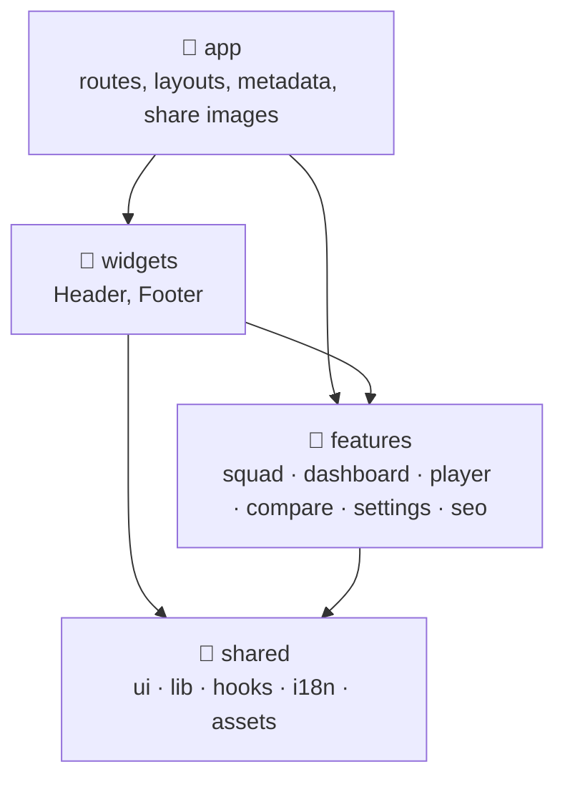
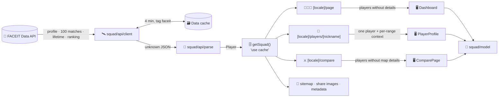

# 🏗️ Architecture

## 🧱 Technology stack

| Layer        | Choice                                                                        |
| ------------ | ----------------------------------------------------------------------------- |
| ⚛️ Framework | Next.js 16 App Router with Cache Components, a proxy, typed routes, Turbopack |
| 🧩 UI        | React 19 with the React Compiler, Server and Client Components                |
| 🎨 Styling   | Tailwind CSS 4 utilities on top of Sass design tokens in `globals.scss`       |
| 📈 Charts    | A hand-written SVG line chart and HTML bars, no chart library                 |
| 🌍 Languages | Ten typed catalogs, `Intl` for plurals, numbers and dates, no i18n library    |
| 🔷 Language  | TypeScript 7 in strict mode with `noUncheckedIndexedAccess`                   |
| 🧹 Quality   | Oxlint (type-aware), Oxfmt, Vitest, Testing Library, Playwright, axe          |
| 🌐 Data      | FACEIT Data API v4 with a server-side key                                     |

## 🗂️ Layers

The source follows a feature-sliced layout of four layers. Each layer may only import from the layers below it:



| Layer       | Folder                   | Holds                                                                                          |
| ----------- | ------------------------ | ---------------------------------------------------------------------------------------------- |
| 🧭 App      | `src/app`                | Next.js routes, layouts, loading and error states, metadata files and share images             |
| 🧱 Widgets  | `src/widgets/<Name>`     | Page chrome built from features: the header with its navigation and settings, the footer       |
| 🧩 Features | `src/features/<feature>` | One folder per domain area, split into `api`, `model` and `ui` segments                        |
| 🧰 Shared   | `src/shared`             | Building blocks with no knowledge of the squad: UI kit, formatting, hooks, translations, fonts |

| Feature        | Segments             | Responsibility                                                               |
| -------------- | -------------------- | ---------------------------------------------------------------------------- |
| 🧑‍🤝‍🧑 `squad`     | `api`, `model`, `ui` | Loading the squad from FACEIT, ranges, statistics, levels, maps, duos, names |
| 📊 `dashboard` | `model`, `ui`        | The squad overview, the recent matches feed and the records                  |
| 👤 `player`    | `model`, `ui`        | The player page and the per-range context it receives from the server        |
| ⚔️ `compare`   | `model`, `ui`        | The comparison of two players                                                |
| ⚙️ `settings`  | `model`, `ui`        | The settings panel: the theme in `localStorage` and the language links       |
| 🔎 `seo`       | `model`, `og`, `ui`  | Structured data, social metadata and the generated share images              |

> [!IMPORTANT]
> The direction of imports is enforced by Oxlint's `no-restricted-imports` in `.oxlintrc.json`: shared code cannot import features, widgets or routes, and features cannot import widgets or routes. Features may use each other, so the pages build on the `squad` feature.

Every component has its own folder named after it, with its tests next to it: `shared/ui/Avatar/Avatar.tsx`, `features/dashboard/ui/MapPool/MapPool.tsx`. Components are arrow functions with a default export; models, hooks and helpers use named exports.

`src/proxy.ts` sits next to the layers because Next.js expects it there, and `src/test` holds the test setup and fixtures.

## 🔀 Data flow



1. 🚦 `src/proxy.ts` runs first: it sends addresses without a language to the visitor's language, lowercases the language of an address, fixes the letter case of nicknames and turns nicknames outside the squad into a 404, all without touching FACEIT.
2. 🗄️ `getSquad()` in `src/features/squad/api/loader.ts` loads every nickname of `FACEIT_PLAYERS` on the server and returns a **snapshot**.
3. 📄 The pages render the snapshot into static HTML per language; the header, hero and metadata are Server Components.
4. 🖥️ `Dashboard`, `PlayerProfile` and `ComparePage` are Client Components. They compute every statistic for the selected range in the browser, so switching the range never waits for the network.

### 📦 What reaches the browser

Each page sends only what it shows:

| Page        | Payload                                                                                                                         |
| ----------- | ------------------------------------------------------------------------------------------------------------------------------- |
| 🧑‍🤝‍🧑 Overview | Every player with up to 100 matches, without lifetime and map statistics                                                        |
| 👤 Player   | One player with matches, lifetime and maps, the names and levels of the squad, and squad averages and teammates for every range |
| ⚔️ Compare  | Every player with matches and lifetime numbers, without map statistics                                                          |

The player page prepares squad averages, teammates and the squad mates of every match on the server for all six ranges (`src/features/player/model/profile.ts`), so the other players' matches never travel to the browser.

## 🛰️ FACEIT client

`src/features/squad/api/client.ts` is marked `server-only`, so importing it from a Client Component fails the build and the key cannot leak into the browser bundle.

| Concern            | Behaviour                                                                                                                  |
| ------------------ | -------------------------------------------------------------------------------------------------------------------------- |
| 🔑 Authentication  | `Authorization: Bearer <FACEIT_API_KEY>` on every request                                                                  |
| 🚦 Rate limit      | FACEIT allows 20 requests per second; the client starts at most 10 per second                                              |
| 🔁 Retries         | Up to six attempts with exponential backoff and jitter, capped at 8 seconds, honouring `retry-after` and `ratelimit-reset` |
| ⏱️ Timeouts        | Ten seconds per request                                                                                                    |
| 🗃️ Shared cache    | Responses are kept in the Next.js data cache for four minutes with the `faceit` tag                                        |
| 🙅 404             | Returns `null`, which the loader reports as an unknown nickname                                                            |
| ⛔ 400 / 401 / 403 | Throws `FaceitError("unauthorized")` straight away, a wrong key is never retried                                           |
| 🧭 Base address    | `FACEIT_API_URL`, or the public Data API by default; the end-to-end tests point it at a mock                               |

Per player the loader asks for the profile, then for the last 100 match statistics, the lifetime statistics and the region ranking in parallel. Lifetime and ranking are optional: if they fail, the player still loads. Avatars are checked with a `HEAD` request, because FACEIT's CDN keeps some dead images; a dead avatar falls back to the player's initial.

## 🧪 Parsing

The client returns `unknown`. `src/features/squad/api/parse.ts` reads every field through small guards (`text`, `optionalNumber`, `imageUrl`) instead of trusting the response shape:

- 🔢 FACEIT sends most numbers as strings: they are parsed, and anything that is not a finite number becomes `0` or `null`.
- 🎮 Only `5v5` matches are kept; duplicates are dropped and the list is sorted newest first.
- 🏁 `Score` (`"13 / 10"`) is turned into the player's own score and the opponent's using `Final Score`, so scores always read from the player's side.
- 🗺️ Lifetime map segments (`"Dust2"`) are matched to match maps (`de_dust2`) through `mapKey()`.
- 🖼️ Image URLs are accepted only from `distribution.faceit-cdn.net` and `assets.faceit-cdn.net`, the same hosts `next/image` allows.
- 📈 Rates such as `"0.53"` become percentages.
- ⭐ Every match gets two derived numbers from `src/features/squad/model/rating.ts`: the HLTV 1.0 rating, from kills, deaths and the 2K to 5K rounds per round, and the share of rounds survived.

## 🗄️ Snapshots

```ts
type SquadSnapshot =
  | { status: "ready"; players: Player[]; failed: FailedPlayer[]; updatedAt: number }
  | { status: "unconfigured"; missing: ConfigVariable[] }
  | { status: "unavailable"; reason: "unauthorized" | "rate-limited" | "unreachable"; updatedAt: number };
```

| Status            | When                                                      | Page shows                                      |
| ----------------- | --------------------------------------------------------- | ----------------------------------------------- |
| ✅ `ready`        | At least one player loaded                                | The dashboard, plus a notice for failed players |
| ⚙️ `unconfigured` | `FACEIT_API_KEY` or `FACEIT_PLAYERS` is empty             | Which variables to set                          |
| 🚫 `unavailable`  | The key was rejected, or no player could be loaded at all | What went wrong and that it retries             |

## ⚡ Caching

Three layers keep FACEIT traffic low:

| Layer                 | Where                                             | Lifetime                                      |
| --------------------- | ------------------------------------------------- | --------------------------------------------- |
| 🗃️ Data cache         | Every `fetch` in the FACEIT client                | Four minutes, shared by all renders and pages |
| 🔂 One load at a time | `getSquad()` joins a load that is already running | Until that load finishes                      |
| 🗄️ `"use cache"`      | The snapshot of `getSquad()`                      | Depends on the outcome, see below             |

`getSquad()` starts with `"use cache"`, so its result becomes part of each page's static shell and is shared by everything rendered in the same pass: the pages in all ten languages, their metadata, the sitemap and the share images.

| Outcome                                       | `cacheLife`                                           |
| --------------------------------------------- | ----------------------------------------------------- |
| ✅ Every player loaded                        | `faceit`: stale 5 min, revalidate 5 min, expire 1 day |
| 🔁 Some players failed for a transient reason | `minutes`: revalidate after 1 minute                  |
| ⚙️ Not configured or key rejected             | `minutes`                                             |

When a page is older than its revalidation time, the next visitor still gets the cached page instantly while Next.js regenerates it in the background.

> [!NOTE]
> If **no player** can be loaded during that regeneration on a production server, `getSquad()` throws on purpose, and Next.js keeps serving the last good version instead of replacing it with an error. During `next build` and in development it returns the `unavailable` snapshot instead, so a build never fails just because FACEIT is down.

## 🖥️ Rendering

| Route                                                         | Rendering                                                                     |
| ------------------------------------------------------------- | ----------------------------------------------------------------------------- |
| `/[locale]`                                                   | 📄 Static for all ten languages, regenerated in the background                |
| `/[locale]/players/[nickname]`                                | 📄 Prerendered for every squad member and language via `generateStaticParams` |
| `/[locale]/compare`                                           | 📄 Static; the pair comes from the address in the browser                     |
| `/[locale]/**/opengraph-image/card`                           | 🖼️ Prerendered PNGs per page and language, regenerated with the data          |
| `/sitemap.xml`, `/robots.txt`, `/manifest.webmanifest`, icons | 📄 Static                                                                     |
| Anything else                                                 | 🚫 `global-not-found.tsx` with status 404                                     |

`generateStaticParams` uses the canonical nicknames from FACEIT, so `/en/players/JACKSONGG` is prerendered even if `FACEIT_PLAYERS` spells it differently. The language comes from the `[locale]` segment, which Server Components read through `next/root-params`.

## 🌍 Languages

Catalogs live in `src/shared/i18n/messages`, one typed file per language. Server Components, metadata and share images call `getI18n(locale)`; the layout passes the catalog of the current language to `I18nProvider`, and Client Components read it with `useI18n()`. Numbers, percentages, dates, relative times and lists are formatted by `Intl` in the page language. The details are in [Localization](./i18n.md).

## 🧮 Statistics

Everything below is a pure function with tests next to it.

| Module                                 | Responsibility                                                                                                                 |
| -------------------------------------- | ------------------------------------------------------------------------------------------------------------------------------ |
| `features/squad/model/range.ts`        | The six ranges, parsing `?range=` and picking the matches of a day or match range                                              |
| `features/squad/model/stats.ts`        | `summarize()` averages every per-match number like FACEIT does; `rank()` gives tied values the same place; `rollingAverage()`  |
| `features/squad/model/rating.ts`       | The HLTV 1.0 rating of a match and the share of rounds survived                                                                |
| `features/squad/model/metrics.ts`      | Labels, digits and the good and weak thresholds of every metric, and `metricTone()` that colours a value                       |
| `features/squad/model/maps.ts`         | Map names and keys, and `mapImages()`: the picture of every map from the squad's lifetime statistics                           |
| `features/squad/model/squad.ts`        | The view model: `viewPlayers()` cuts each player to the range, squad averages, ranks, map columns and cells, trend series      |
| `features/squad/model/form.ts`         | Current and longest streaks                                                                                                    |
| `features/squad/model/together.ts`     | Lineups, duos, teammates and lineup sizes                                                                                      |
| `features/squad/model/levels.ts`       | FACEIT CS2 level thresholds, colours and the progress to the next level                                                        |
| `features/dashboard/model/activity.ts` | The recent matches feed: one entry per match with every squad member on their side                                             |
| `features/dashboard/model/records.ts`  | Single-match records with eligibility rules, the longest streak and aces                                                       |
| `features/compare/model/compare.ts`    | Shared matches of two players, their record together and against each other, the leader of a row and the pair from the address |
| `features/player/model/profile.ts`     | The per-range context of a player page and slimmer players for the browser                                                     |
| `shared/lib/scale.ts`                  | Nice chart scales with round ticks                                                                                             |
| `shared/lib/format.ts`                 | Numbers, signed differences, percentages, dates in any time zone, relative times, lists and country names                      |

### 🤝 How shared matches are found

FACEIT's match statistics contain a match id per player. Squad members who share a match id **and** the same result were on the same team; the same id with opposite results means they played against each other. `lineups()` groups the range of every player by `matchId + result`, `duos()` counts every pair inside a lineup, `partySizes()` counts lineups by the number of squad members, `activityFeed()` puts both sides of a match into one entry and `sharedMatches()` lines up two players. No extra API requests are needed.

## 🎚️ Client state

| State                        | Where it lives                                                                                                                                    |
| ---------------------------- | ------------------------------------------------------------------------------------------------------------------------------------------------- |
| 🎚️ Range and compared pair   | The `range`, `a` and `b` search parameters, read with `useSyncExternalStore` and updated with `history.replaceState`, so the pages stay static    |
| 🌗 Theme                     | `localStorage` and `data-theme` on `<html>`, applied by an inline script in `<head>` before the first paint, together with the `theme-color` meta |
| ⚡ Effects                   | `localStorage` and `data-effects` on `<html>`, resolved by the same script from the saved choice or the device, switched by `setEffects()`        |
| 🕒 Time zone, clock          | `useSyncExternalStore` with a UTC server snapshot; the inline script already rewrites `<time>` elements in the visitor's zone before hydration    |
| 🔀 Sorting, metrics, filters | Plain `useState` inside each section                                                                                                              |
| 🖼️ Map pictures              | Collected once per page with `mapImages()` and shared with every `MapThumb` through `MapImagesProvider`, a React context                          |

When the address asks for something other than the prerendered default (`?range=`, `?a=`, `?b=`), the inline script marks the page as pending and the data sections stay hidden until React has applied the address, so visitors never see the default range flash before their own.

> [!TIP]
> If JavaScript fails to load, a CSS animation reveals the data after three seconds anyway, so a pending page can never stay blank.

## 🛠️ Tooling decisions

- 🦀 **Oxlint and Oxfmt** replace ESLint and Prettier: one fast tool each, with type-aware rules through `oxlint-tsgolint`, the Next.js, React Compiler and jsx-a11y rule sets, the layer rules and the custom `local/short-comments` rule.
- 🔷 **TypeScript 7**: `next build` runs the project's `tsc` CLI, which is the native compiler.
- 📈 **No chart library**: the only chart is a line chart; drawing it as SVG on the server gives charts that render without JavaScript, never shift the layout and weigh a few kilobytes.
- 🌍 **No i18n library**: typed catalogs, `Intl.PluralRules` and a few lines of interpolation cover everything, and a missing key is a type error.
- 🗄️ **Cache Components** instead of route-level `revalidate`: caching sits next to the data it describes, and different outcomes can have different lifetimes.
- 🎭 **Playwright with a mock API**: the end-to-end tests build the real app against `e2e/faceit-api.ts`, so they are fast, deterministic and never touch the real quota.
- 🤖 **No agent files**: `agentRules: false` keeps `next dev` from adding AI agent instruction files to the repository.
- 📦 **Explicit install scripts**: npm blocks dependency install scripts unless `allowScripts` in `package.json` approves them; the two that exist (`@parcel/watcher`, `fsevents`) are denied because both ship prebuilt binaries.
