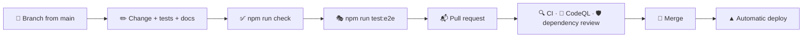

# 🤝 Contributing

## 🔄 Workflow



1. 🌿 Create a branch from `main`.
2. ✅ Make your changes, add tests and run `npm run check`.
3. 🎭 For anything visitors see, run `npm run test:e2e` as well: it covers redirects, accessibility, phones and the Lighthouse budget.
4. 📬 Open a pull request and fill in the checklist from the template.
5. ▲ Merge once everything is green; `main` deploys automatically.

Bugs and ideas go through the issue forms in `.github/ISSUE_TEMPLATE`; security problems are reported privately as described in the [security policy](../.github/SECURITY.md).

## 🧹 Code style

Formatting and linting are automated, so reviews can focus on behaviour.

- 🎨 **Oxfmt** formats TypeScript, SCSS, JSON, YAML and Markdown with a print width of 120 and sorts imports. Run `npm run format`.
- 🧹 **Oxlint** enables the `correctness`, `suspicious` and `perf` categories with type-aware TypeScript rules, React hooks and React Compiler rules, the Next.js, `jsx-a11y`, `import`, `unicorn` and `vitest` plugins and the layer rules. Run `npm run lint`.
- 🔷 **TypeScript** runs in strict mode with `noUncheckedIndexedAccess`, `verbatimModuleSyntax` and `erasableSyntaxOnly`.

### 🚫 No comments

> [!IMPORTANT]
> The codebase contains no comments: names, small functions and types carry the intent instead. A custom Oxlint plugin in `lint/no-comments.js` (`local/no-comments`) reports every comment in JavaScript and TypeScript files, including lint directives.

Styles, configuration, workflows and templates follow the same convention. If something needs explanation, prefer a better name, an extracted function or a few lines in `docs/`.

### 🧭 Where code goes

| You are adding…                     | Put it in                                                                 |
| ----------------------------------- | ------------------------------------------------------------------------- |
| A FACEIT endpoint                   | `src/features/squad/api/client.ts`                                        |
| A field from a FACEIT response      | `src/features/squad/api/parse.ts` and `src/features/squad/model/types.ts` |
| A statistic or rule about players   | A pure function in `src/features/squad/model/`                            |
| A section of the squad overview     | `src/features/dashboard/ui/`                                              |
| A section of the player page        | `src/features/player/ui/`                                                 |
| A section of the compare page       | `src/features/compare/ui/`                                                |
| Something every page shows          | `src/features/squad/ui/`                                                  |
| Metadata, structured data, a card   | `src/features/seo/`                                                       |
| Part of the header or footer        | `src/widgets/Header/` or `src/widgets/Footer/`                            |
| A building block without squad data | `src/shared/ui/`                                                          |
| A formatter or a generic helper     | `src/shared/lib/`                                                         |
| Browser state                       | A hook in `src/shared/hooks/`, or in a feature's `model/`                 |
| A text                              | Every catalog in `src/shared/i18n/messages/`                              |
| A language                          | See [Localization](./i18n.md#-adding-a-language)                          |
| A browser scenario                  | `e2e/*.spec.ts`, with data in `e2e/faceit-api.ts`                         |

> [!WARNING]
> `shared` must not import from `features`, `widgets` or `app`, and `features` must not import from `widgets` or `app`. Oxlint fails the build otherwise; move the code down a layer or pass the data in as props.

### 📐 Conventions

| Topic            | Convention                                                                                                                                                                               |
| ---------------- | ---------------------------------------------------------------------------------------------------------------------------------------------------------------------------------------- |
| 🧩 Components    | One component per file, a named `function` export, PascalCase file names; `"use client"` only where hooks or events are needed                                                           |
| 🧮 Logic         | Pure functions in a `model/` or `lib/` folder that take plain data and return plain data, tested next to them                                                                            |
| 🎨 Styles        | Tailwind utilities with the design tokens (`bg-surface`, `text-ink-muted`, `bg-data`); raw colours only for levels, medals and the brand mark                                            |
| 🖍️ Data marks    | Bars and legend swatches carry the `mark`, `mark-muted` or `mark-line` class, selectable options the `choice` class, so they stay visible in forced colours mode                         |
| ✍️ Text          | Every UI text in all eight catalogs, never in a component; no em or en dashes, use commas, colons or plain hyphens such as `12-8`; gaming terms such as ELO, K/D and ADR stay in English |
| ♿ Accessibility | Native elements first, a label for every control, colour never alone                                                                                                                     |
| 📥 Imports       | The `@/` alias for anything outside the current folder, relative paths inside it                                                                                                         |
| 🧪 Tests         | Next to the code as `*.test.ts(x)`; query by role and accessible name                                                                                                                    |

## ➕ Adding a metric

1. 🧪 Parse the field in `parseMatch()` and add it to `Match` in `src/features/squad/model/types.ts`.
2. 🧮 Average or total it in `summarize()` in `src/features/squad/model/stats.ts`.
3. 🏷️ Add a definition to `METRICS` in `src/features/squad/model/metrics.ts` with the message keys of its short label and name, the digits and whether it is a percentage, and add both texts to every catalog.
4. 📋 Add its key to `METRIC_KEYS` or `MATCH_METRIC_KEYS`; the leaderboard, rankings, trends and form tiles pick it up.
5. ✅ Extend the parser and statistics tests.

## 📝 Commit messages

Commits follow [Conventional Commits](https://www.conventionalcommits.org/):

```text
feat(player): add a map filter to the match history
fix(faceit): retry when the API answers 503
style: refine the leaderboard medals
docs: describe the caching profiles
chore(deps): update dependencies
```

| Type          | Use it for                         |
| ------------- | ---------------------------------- |
| ✨ `feat`     | A new feature                      |
| 🐛 `fix`      | A bug fix                          |
| ♻️ `refactor` | Code changes without new behaviour |
| 💄 `style`    | Visual and styling changes         |
| ✅ `test`     | Adding or updating tests           |
| 📝 `docs`     | Documentation                      |
| 👷 `ci`       | Pipeline and automation            |
| 🔧 `chore`    | Dependencies and maintenance       |
