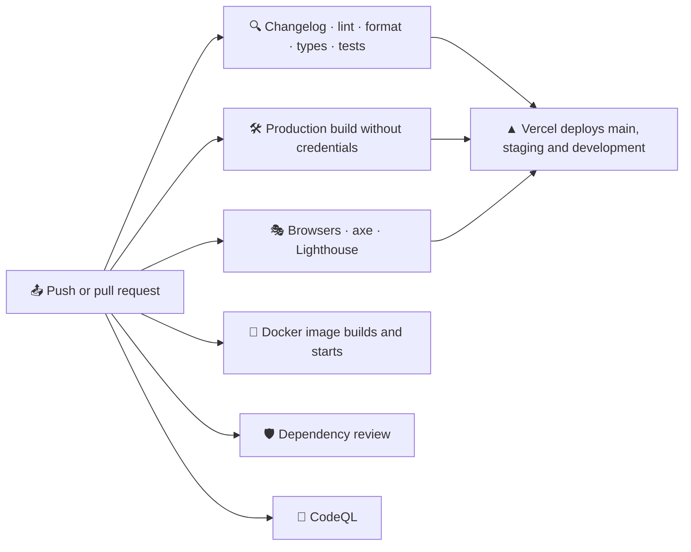

# 🚀 Deployment

FACEIT Stats is a regular Next.js server: it needs Node.js, `FACEIT_API_KEY` and `FACEIT_PLAYERS` both for the build and at run time, and `SITE_URL` on a custom domain. There is no database.

## 🔁 Pipeline

CI runs on pushes to `main`, `staging` and `development`, on pull requests into them and on demand. Version tags start the release workflow described in [Releases](./releases.md).



| Job                  | Workflow      | What it does                                                                                                                                                                                                            |
| -------------------- | ------------- | ----------------------------------------------------------------------------------------------------------------------------------------------------------------------------------------------------------------------- |
| 🔍 Verify            | `ci.yml`      | Install, registry signatures, a changelog section for the current version, Oxlint, Oxfmt, types, unit tests with coverage, a coverage summary and the HTML report                                                       |
| 🛠️ Build             | `ci.yml`      | `next build` without FACEIT credentials, then `scripts/build-report.mjs` checks every language, the 404 page, sitemap, robots, icons and security headers and reports the bundle size                                   |
| 🎭 E2E               | `ci.yml`      | Chromium from a cache keyed by the Playwright version, a production build against the mock FACEIT API, Playwright on desktop and phone, axe, forced colours, reflow and the Lighthouse budget, with the report uploaded |
| 🐳 Docker            | `ci.yml`      | Builds the staging image from `docker/Dockerfile` without credentials, starts it and waits until `/robots.txt` answers                                                                                                  |
| 🛡️ Dependency review | `ci.yml`      | Pull requests fail on new dependencies with high-severity advisories                                                                                                                                                    |
| 🔬 CodeQL            | `codeql.yml`  | `security-extended` queries for TypeScript and the workflows on every change and every Monday                                                                                                                           |
| 🏷️ Release           | `release.yml` | On a `v*.*.*` tag: checks that the tag matches `package.json` and sits on `main`, then publishes the GitHub release with the notes from `CHANGELOG.md`                                                                  |

The build job proves that the app builds without secrets: with no key, every page prerenders the setup screen.

## ⚙️ One-time GitHub setup

1. Open **Settings → Code security** and enable **Private vulnerability reporting**, **Dependabot alerts** and **Code scanning** (CodeQL uploads its results there).
2. Create `development` and `staging`, make `development` the default branch and protect `main` and `staging` as described in [Releases](./releases.md#️-one-time-github-setup).

> [!TIP]
> The `e2e` job never needs a real API key: the mock server answers every request, so forks and Dependabot pull requests run the full suite too.

## ☁️ Hosting

### ▲ Vercel

1. 📥 Import the repository in Vercel. The framework preset **Next.js** needs no changes.
2. 🔑 Add the environment variables for **Production** and **Preview**:

   | Variable         | Value                                      |
   | ---------------- | ------------------------------------------ |
   | `FACEIT_API_KEY` | The server-side key                        |
   | `FACEIT_PLAYERS` | The squad, for example `sacrificed,Nitron` |
   | `SITE_URL`       | Only for a custom domain                   |

3. 🚀 Deploy. `main` is the production branch; `staging`, `development` and every pull request get preview deployments, see [Environments](./releases.md#️-environments).

Without `SITE_URL` the production domain from `VERCEL_PROJECT_PRODUCTION_URL` is used for canonical links and Open Graph cards.

> [!IMPORTANT]
> Vercel takes the Node.js version from `engines.node` in `package.json`. `>=24` lets it build with the newest major it supports, 24 today, and move to 26 on its own once Vercel offers it. A range that only allows a newer line than Vercel supports, such as `>=26`, fails the build with "invalid or discontinued Node.js Version".

> [!NOTE]
> Preview deployments are kept out of search engines automatically: robots disallow everything and pages are marked `noindex`.

> [!WARNING]
> Changing an environment variable on Vercel needs a new deployment, because the player pages are prerendered from the squad at build time.

All ten languages are part of every deployment; there is nothing to configure. The proxy that picks the language runs on the Node.js runtime next to the pages.

### 🐳 Docker

The shared service lives in `compose.yaml` at the root, and everything else in `docker/`: one multi-stage `Dockerfile` and an overlay per environment. `.dockerignore` keeps `node_modules`, build output, docs and every `.env*` file out of the build context.

| File                      | What it adds                                                                                |
| ------------------------- | ------------------------------------------------------------------------------------------- |
| `compose.yaml`            | The `app` service: build context, `docker/Dockerfile` and an init process                   |
| `docker/Dockerfile`       | Stages `base`, `deps`, `development`, `build` and `runtime`, a non-root standalone server   |
| `docker/development.yaml` | The dev server with hot reload through Compose Watch, variables from `.env`, port 3000      |
| `docker/staging.yaml`     | The production build with `APP_ENV=staging`, variables from `.env.staging`, port 3001       |
| `docker/production.yaml`  | The production build with `APP_ENV=production`, variables from `.env.production`, port 3000 |

```bash
docker compose -f compose.yaml -f docker/development.yaml up --watch
docker compose -f compose.yaml -f docker/staging.yaml up --build -d
docker compose -f compose.yaml -f docker/production.yaml up --build -d
```

- 🔐 **Secrets never enter the image.** The environment file is read at run time through `env_file` and mounted during the build as a BuildKit secret, so the prerendered pages can load the squad without the key landing in a layer.
- 🧭 **`APP_ENV` decides indexing.** Every value except `production` turns on `noindex` and a `Disallow: /` robots file, the same as a Vercel preview.
- 📦 **The runtime stage is small.** `NEXT_OUTPUT=standalone` switches on the [standalone output](https://nextjs.org/docs/app/api-reference/config/next-config-js/output) only for Docker; the image keeps `server.js`, the traced dependencies and the static files, runs as the `node` user and reports its health through `/robots.txt`.
- 🔢 **Ports** default to 3000 and 3001, so staging and production fit on one host; `APP_PORT` overrides them. Staging and production restart on failure and rotate their logs.

> [!WARNING]
> The build talks to the FACEIT Data API, so the machine that builds the image needs network access and a valid key in the environment file.

### 🖥️ Any Node.js host

Any server with Node.js 24 or newer works, 26 is recommended:

```bash
npm ci
npm run build
PORT=3000 npm start
```

- 🔑 Provide `FACEIT_API_KEY`, `FACEIT_PLAYERS` and `SITE_URL` as environment variables or in `.env` before `npm run build`.
- 🔒 Put a reverse proxy with TLS in front of the server; the app sends `Strict-Transport-Security` in production.
- 🗄️ A long-running server keeps cached data in memory and FACEIT responses in the data cache under `.next/cache`, so pages are regenerated at most once per five minutes in total. On serverless platforms each regeneration loads the squad again, and the data cache of the platform keeps FACEIT responses for four minutes.

## 🗃️ Caching in production

| Situation                       | What visitors get                                                            |
| ------------------------------- | ---------------------------------------------------------------------------- |
| ⚡ Page younger than 5 minutes  | The cached page                                                              |
| 🔄 Page older than 5 minutes    | The cached page, while a fresh one is generated in the background            |
| 💤 No visits for a day          | The first visit waits for fresh data                                         |
| 🚫 FACEIT down during a refresh | The last good page stays online and the refresh is retried on the next visit |
| 🔑 Key rejected                 | A page that explains the problem, retried every minute                       |

See [Architecture](./architecture.md#-caching) for the details.

## 🤖 Dependency updates

`.github/dependabot.yml` checks for updates every Monday:

- 🌱 pull requests target `development`, so updates reach production with the next release;
- 📦 npm minor and patch updates are grouped into one pull request for production and one for development dependencies; major updates arrive separately;
- ⚙️ GitHub Actions updates are grouped into a single pull request;
- 🐳 the base images in `docker/Dockerfile` are updated one by one;
- 📝 commit messages follow the project convention (`chore(deps): …`, `ci(deps): …`, `build(deps): …`).

CI, the dependency review and CodeQL run on each of them.

## 🖐️ Checking a build locally

```bash
npm run check
npm run build
npm start
```

Open `http://localhost:3000` and check the squad overview in a couple of languages (`/en`, `/uk`), a player page, `/en/compare`, `/sitemap.xml`, `/robots.txt` and a share image such as `/en/opengraph-image/card`.

`npm run test:e2e` does the same automatically against the mock FACEIT API, including accessibility and the Lighthouse budget, without spending any of your FACEIT quota.
