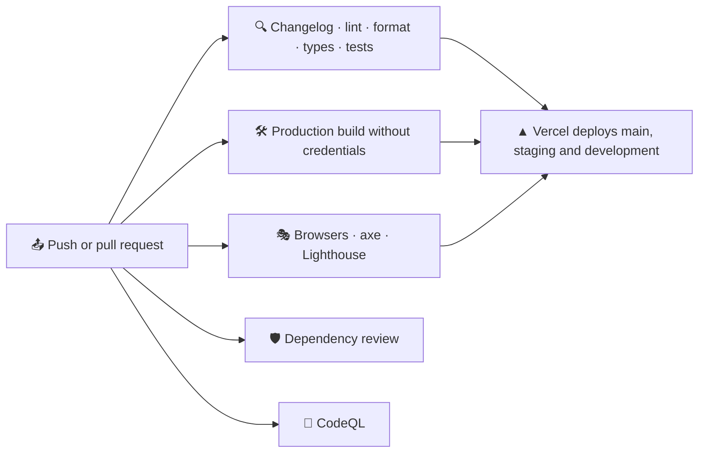

# 🚀 Deployment

## 🔁 Pipeline

CI runs on pushes to `main`, `staging` and `development`, on pull requests into them and on demand. Version tags start the release workflow described in [Releases](./releases.md).



| Job                  | Workflow      | What it does                                                                                                                                                                                                            |
| -------------------- | ------------- | ----------------------------------------------------------------------------------------------------------------------------------------------------------------------------------------------------------------------- |
| 🔍 Verify            | `ci.yml`      | Install, registry signatures, a changelog section for the current version, Oxlint, Oxfmt, types, unit tests with coverage, a coverage summary and the HTML report                                                       |
| 🛠️ Build             | `ci.yml`      | `next build` without FACEIT credentials, then `scripts/build-report.mjs` checks every language, the 404 page, sitemap, robots, icons and security headers and reports the bundle size                                   |
| 🎭 E2E               | `ci.yml`      | Chromium from a cache keyed by the Playwright version, a production build against the mock FACEIT API, Playwright on desktop and phone, axe, forced colours, reflow and the Lighthouse budget, with the report uploaded |
| 🛡️ Dependency review | `ci.yml`      | Pull requests fail on new dependencies with high-severity advisories                                                                                                                                                    |
| 🔬 CodeQL            | `codeql.yml`  | `security-extended` queries for TypeScript and the workflows on every change and every Monday                                                                                                                           |
| 🏷️ Release           | `release.yml` | On a `v*.*.*` tag: checks that the tag matches `package.json` and sits on `main`, then publishes the GitHub release with the notes from `CHANGELOG.md`                                                                  |

The build job proves that the app builds without secrets: with no key, every page prerenders the setup screen.

## ▲ Vercel

1. 📥 Import the repository in Vercel. The framework preset **Next.js** needs no changes.
2. 🔑 Add the environment variables for **Production** and **Preview**:

   | Variable         | Value                                      |
   | ---------------- | ------------------------------------------ |
   | `FACEIT_API_KEY` | The server-side key                        |
   | `FACEIT_PLAYERS` | The squad, for example `sacrificed,Nitron` |
   | `SITE_URL`       | Only for a custom domain                   |

3. 🚀 Deploy. `main` is the production branch; `staging`, `development` and every pull request get preview deployments, see [Environments](./releases.md#️-environments).

Without `SITE_URL` the production domain from `VERCEL_PROJECT_PRODUCTION_URL` is used for canonical links and Open Graph cards.

> [!NOTE]
> Preview deployments are kept out of search engines automatically: robots disallow everything and pages are marked `noindex`.

> [!WARNING]
> Changing an environment variable on Vercel needs a new deployment, because the player pages are prerendered from the squad at build time.

All ten languages are part of every deployment; there is nothing to configure. The proxy that picks the language runs on the Node.js runtime next to the pages.

## 🖥️ Self-hosting

Any server with Node.js 24.15 or newer works:

```bash
npm ci
npm run build
PORT=3000 npm start
```

- 🔑 Provide `FACEIT_API_KEY`, `FACEIT_PLAYERS` and `SITE_URL` as environment variables or in `.env` before `npm run build`.
- 🔒 Put a reverse proxy with TLS in front of the server; the app sends `Strict-Transport-Security` in production.
- 🗄️ A long-running server keeps cached data in memory and FACEIT responses in the data cache under `.next/cache`, so pages are regenerated at most once per five minutes in total. On serverless platforms each regeneration loads the squad again, and the data cache of the platform keeps FACEIT responses for four minutes.

## 🗄️ Caching in production

| Situation                       | What visitors get                                                            |
| ------------------------------- | ---------------------------------------------------------------------------- |
| ⚡ Page younger than 5 minutes  | The cached page                                                              |
| 🔄 Page older than 5 minutes    | The cached page, while a fresh one is generated in the background            |
| 💤 No visits for a day          | The first visit waits for fresh data                                         |
| 🚫 FACEIT down during a refresh | The last good page stays online and the refresh is retried on the next visit |
| 🔑 Key rejected                 | A page that explains the problem, retried every minute                       |

See [Architecture](./architecture.md#-caching) for the details.

## 🤖 Dependency updates

Dependabot opens grouped pull requests against `development` every Monday: minor and patch updates for runtime and development dependencies, and one for GitHub Actions. Major updates arrive one by one. CI, the dependency review and CodeQL run on each of them, and the updates reach production with the next release.

## 🖐️ Checking a build locally

```bash
npm run check
npm run build
npm start
```

Open `http://localhost:3000` and check the squad overview in a couple of languages (`/en`, `/uk`), a player page, `/en/compare`, `/sitemap.xml`, `/robots.txt` and a share image such as `/en/opengraph-image/card`.

`npm run test:e2e` does the same automatically against the mock FACEIT API, including accessibility and the Lighthouse budget, without spending any of your FACEIT quota.
