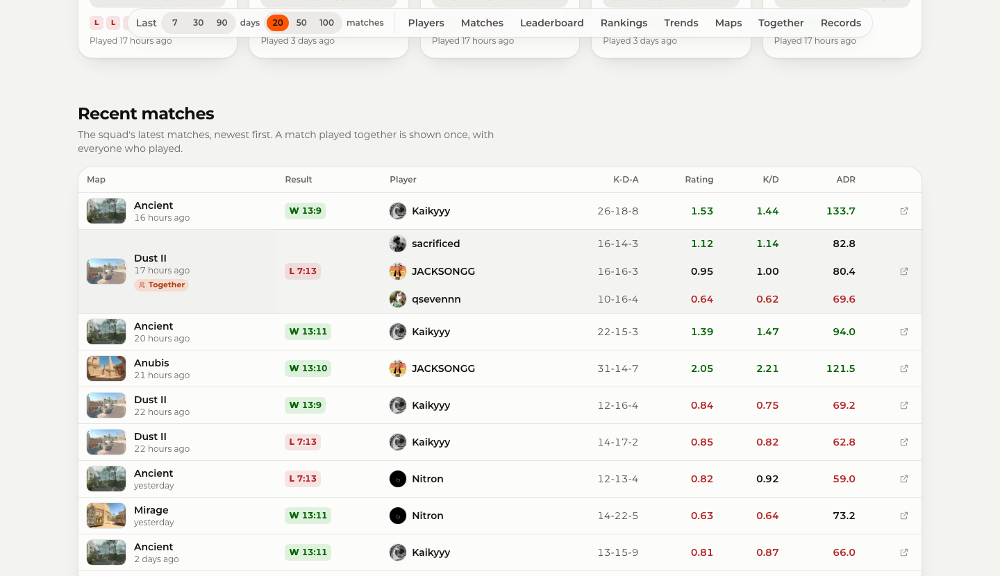
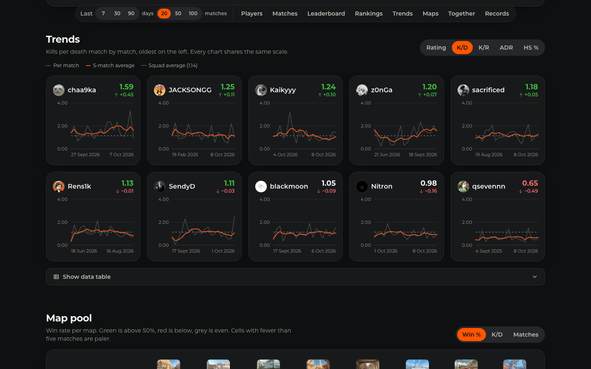
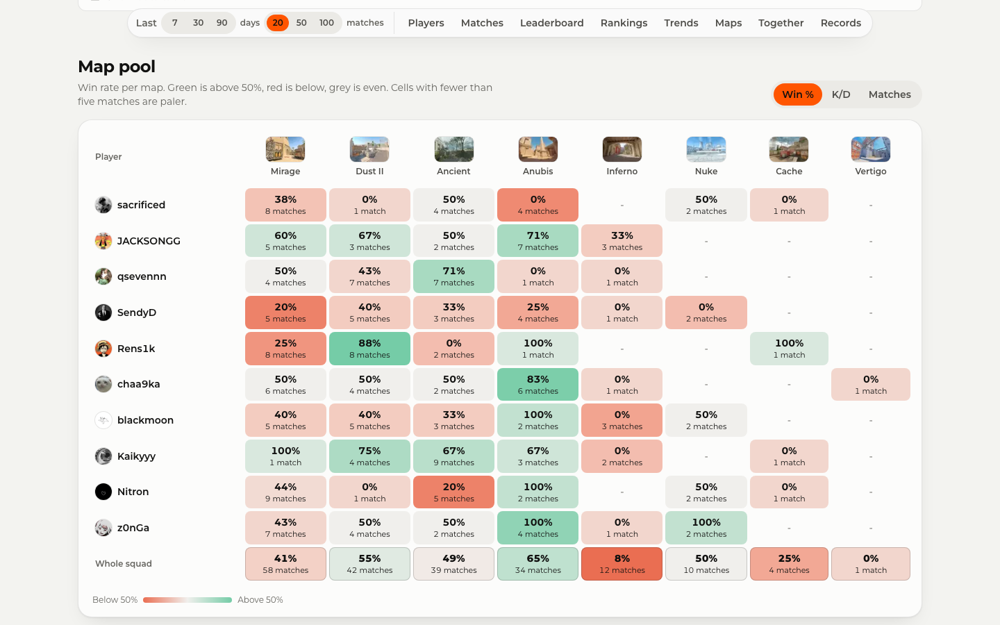

# ✨ Features

## 🧭 Layout

Every page shares one header with the logo, the **Squad** and **Compare** links and the **Settings** button, and one footer with the author, the version, the data source and a link to the source code:

| Page                                  | What it shows                                            |
| ------------------------------------- | -------------------------------------------------------- |
| 🧑‍🤝‍🧑 `/en` Squad overview               | Every player of `FACEIT_PLAYERS` side by side            |
| 👤 `/en/players/<nickname>`           | One player in depth, compared with the rest of the squad |
| ⚔️ `/en/compare?a=<first>&b=<second>` | Two players head to head                                 |

Every address starts with a language, see [Localization](./i18n.md). Below the page title, a floating toolbar stays at the top of the screen while you scroll. It holds the **range** and, on wide screens, links to every section.

## 🎚️ Range

Every number on a page is calculated from one range, chosen in the toolbar:

| Range                                     | Each player's matches                            |
| ----------------------------------------- | ------------------------------------------------ |
| 📅 Last **7**, **30** or **90** days      | Every CS2 match finished in those days           |
| 🔢 Last **20**, **50** or **100** matches | Their own most recent matches, **20** by default |

- 🔗 The range is kept in the address (`?range=30d`, `?range=50`), so a link opens with the same view. Player and compare links carry it along.
- ⚡ FACEIT returns up to 100 matches per player and every range is calculated in the browser, so switching is instant.
- 🗓️ A day range compares everyone over the same period; a match range compares the same amount of play, even if one player plays daily and another once a month.

> [!TIP]
> Share a link to show the same view: the range, the compared players and the language all live in the address.
> [!NOTE]
> Only **5v5** matches count. Wingman, 1v1 and other modes are left out of every statistic, and FACEIT returns at most the last 100 matches of each player.

## 🧑‍🤝‍🧑 Squad overview

### 📊 Overview tiles

| Tile               | Meaning                                                                           |
| ------------------ | --------------------------------------------------------------------------------- |
| 📈 Average ELO     | Mean ELO of the squad with the level it falls into, and the highest-rated player  |
| 🎯 Squad K/D       | Mean of the players' average K/D, and the best player                             |
| 🏆 Squad win rate  | Mean of the players' win rates, and the best player                               |
| 🤝 Played together | Matches in which at least two squad members were on the same team, and their wins |
| 🔥 Hottest streak  | The longest win streak that is still running                                      |

### 🃏 Players

One card per player, sorted by ELO: avatar, nickname and flag, region ranking, level badge, ELO with a bar towards the next level (or the ELO above level 10), K/D, ADR and win rate, the last five results and how long ago the last match was. The whole card opens the player page.

### 🕹️ Recent matches

The latest matches of the whole squad in one feed, newest first:

- 🫂 A match that several squad members played is shown **once** and marked **Together**, with everyone who played, their K-D-A, K/D and ADR.
- ⚔️ When squad members met on opposite teams, both sides are listed with their own result and the match is marked **Squad vs squad**.
- 🔗 Every entry has the map, how long ago it was, the result and score of each side and a link to the FACEIT match room.
- ➕ Eight matches are shown at first, **Show more matches** adds eight more.

### 🏆 Leaderboard

A table of every player with ELO, level, form, matches with the win-loss record, K/D, K/R, ADR, headshot rate and win rate.

- ↕️ Every numeric column header is a button: the first click sorts from high to low, the next one reverses it.
- 🥇 Medals mark the top three of every column; ties share a place. ELO medals count every player, because ELO does not depend on the range.
- 💤 Players without matches in the range stay at the bottom in both sort directions and show a dash.
- ➗ The footer row shows the squad average.
- 📱 On narrow screens the table scrolls sideways while the player column stays in place.

### 📊 Rankings

Horizontal bars for one metric at a time (K/D, K/R, ADR, HS % or Win %), sorted from best to worst, with a vertical line for the squad average.

### 📈 Trends

Small multiples: one chart per player, all on the same scale, so the shapes can be compared directly. Each chart shows the value of every match and a **five-match rolling average**, with the squad average as a dashed reference. Hover, tap or use the arrow keys to read a single match, and open **Show data table** for the numbers.

### 🗺️ Map pool

A heatmap with a row per player and a column per map, ordered by how often the squad plays it:

| Metric     | Colours                                          |
| ---------- | ------------------------------------------------ |
| 🏆 Win %   | Green above 50 %, red below, grey around 50 %    |
| 🎯 K/D     | Green above 1.00, red below                      |
| 🔁 Matches | Darker orange for maps a player picks more often |

Every cell also prints the value and the number of matches, and the **Whole squad** row adds up all players. A cell reaches its full colour only from five matches on, so a map played once or twice stays pale instead of looking like a strength or a weakness.

### 🤝 Playing together

Two squad members who appear in the same match **with the same result** were on the same team. From that:

- 👥 **Win rate by lineup**: results without squad mates, as a duo, trio, four-stack or five-stack.
- 🫂 **Most played duos**: the pairs with the most shared matches, their win rate and when they last played together.

Only matches inside both players' ranges count, so a larger range finds more shared games.

### 🏅 Records

The best performances in the range, each with the player, the map, the score, the date and a link to the FACEIT match room:

| Record                | Rule                                         |
| --------------------- | -------------------------------------------- |
| 🔫 Most kills         | Kills in one match                           |
| ⚡ Highest ADR        | Matches of at least 13 rounds                |
| 🎯 Best K/D           | Matches of at least 13 rounds                |
| 💀 Headshot machine   | Highest headshot rate with at least 15 kills |
| ⭐ Most MVPs          | MVP stars in one match                       |
| 🔥 Longest win streak | Consecutive wins inside the range            |
| 🎖️ Ace club           | Most five-kill rounds                        |

## 👤 Player page

| Section                   | Content                                                                                                                                                                             |
| ------------------------- | ----------------------------------------------------------------------------------------------------------------------------------------------------------------------------------- |
| 🪪 Profile                | Avatar, nickname, country, region ranking, links to the FACEIT and Steam profiles, level and ELO progress, and a **Compare** button                                                 |
| 📊 Current form           | K/D, K/R, ADR, HS % and Win % with the difference to the squad average and the lifetime value, the record and the current streak, the last ten results                              |
| 📈 Trend                  | One metric per match with a five-match rolling average and the squad average                                                                                                        |
| 🗺️ Maps                   | A card per map with the official map art, the range numbers and the all-time FACEIT numbers                                                                                         |
| 📜 Match history          | Date, map, result and score, K-D-A, K/D, K/R, ADR, HS %, MVPs, 3K, 4K and aces, the squad mates in the team and a link to the match room; sortable and filterable by map and result |
| 🫂 Teammates              | Win rate with every squad mate, compared with the player's overall win rate                                                                                                         |
| 🧬 Lifetime and playstyle | All-time matches, win rate, K/D, headshots, ADR and longest streak; entry rate and success, 1v1 and 1v2 clutches, flash success, sniper kills and utility damage                    |
| 🔗 More from the squad    | Links to every other player                                                                                                                                                         |

Scores always show the player's team first. Nicknames in the address are matched without regard to case and redirect to the exact spelling; nicknames outside the squad answer with a 404.

## ⚔️ Compare

Two squad members side by side, picked from two lists or opened from a player's **Compare** button. The pair is kept in the address (`?a=anna&b=Bohdan`), together with the range.

| Part              | Content                                                                                                         |
| ----------------- | --------------------------------------------------------------------------------------------------------------- |
| 🥊 Contenders     | Avatar, level, ELO with the progress to the next level and the last five results of both players                |
| 🤝 Shared history | Matches on the same team with their record, and the head to head score of matches against each other            |
| 📊 Form           | Matches, win rate, K/D, K/R, ADR, headshots, kills and MVPs per match, multi-kills and aces in the range        |
| 🧬 Lifetime       | All-time matches, win rate, K/D, headshots, ADR, entry success, 1v1 clutches, flash success, utility and streak |
| 🗺️ Maps           | Win rate and matches on every map either player played in the range                                             |
| 📜 Shared matches | Every match both played, on the same team or as opponents, with both lines and the match room                   |

Each row draws two bars from the centre and highlights the better value; screen readers hear who is ahead. Picking the player who is already on the other side swaps the two, and **Swap players** flips them in one click.

## 🌍 Languages

English, Ukrainian, Czech, German, Spanish, French, Italian, Dutch, Polish and Portuguese. The **Settings** panel in the header switches the page and keeps the range and the players. Numbers, dates and relative times follow the language and the visitor's time zone. See [Localization](./i18n.md).

## 🌗 Appearance

The theme switch in the header offers **System**, **Light** and **Dark**. The choice is stored in the browser and applied before the first paint, so pages never flash in the wrong theme, and the browser's address bar takes the same colour. See [Design system](./design.md).

## 🔄 Data freshness

Pages are prerendered and regenerated in the background at most every five minutes, so a visit is always instant and the data is never more than a few minutes old. **Updated …** under the title shows when the data was fetched. If FACEIT is unreachable, the last good version stays online. See [Architecture](./architecture.md#-caching).

## ♿ Accessibility

Landmarks, a skip link, one `h1` per page, native radio groups for every switch, sortable headers with `aria-sort`, meters for progress, readable charts with tables and WCAG AA contrast in both themes. Details are in [Accessibility](./accessibility.md).
