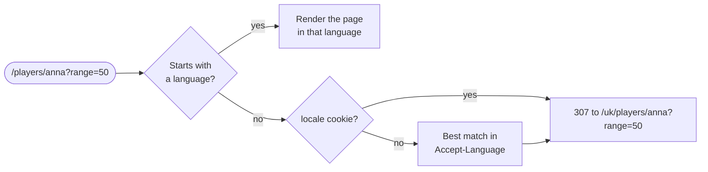
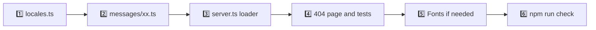

# 🌍 Localization

The site speaks ten languages: 🇬🇧 **English**, 🇺🇦 **Українська**, 🇨🇿 **Čeština**, 🇩🇪 **Deutsch**, 🇪🇸 **Español**, 🇫🇷 **Français**, 🇮🇹 **Italiano**, 🇳🇱 **Nederlands**, 🇵🇱 **Polski** and 🇵🇹 **Português**. Every page exists in each language under its own address, so a shared link always opens in the language it was sent in and search engines can index every version.

## 🧭 Addresses

| Address                     | Page                                    |
| --------------------------- | --------------------------------------- |
| 🧑‍🤝‍🧑 `/en`, `/uk`, `/pl`, …   | Squad overview                          |
| 👤 `/de/players/<nickname>` | Player page                             |
| ⚔️ `/fr/compare?a=…&b=…`    | Comparison of two players               |
| ↪️ `/`, `/players/…`        | Redirect to the visitor's language      |
| 🚫 `/it/nope`               | A real 404, in the language of the path |

## 🔀 How the language is chosen



- 🍪 Picking a language in the header menu stores it in the `locale` cookie for a year, so `/` opens in that language next time.
- 🌐 Without the cookie, `negotiateLocale()` ranks the `Accept-Language` entries by their `q` weight and takes the first supported primary subtag: `de-AT` becomes German, `pt-BR` Portuguese, `sk, cs;q=0.8` Czech, anything else English.
- 🔁 The redirect keeps the path and the query, answers with `307` and sends `Vary: Accept-Language, Cookie`, so a cache never hands one visitor's language to another.
- 🔗 The languages in the settings keep the page and the filters: `/en/players/anna?range=30d` becomes `/de/players/anna?range=30d`.
- 🏷️ `<html lang>`, the title, the description, the Open Graph locale and the structured data follow the language.

All of this happens in `src/proxy.ts`, which runs before every page request. It also lowercases the language of an address, so `/EN/compare` becomes `/en/compare`.

## 🗂️ Where the texts live

| File                               | Role                                                                                    |
| ---------------------------------- | --------------------------------------------------------------------------------------- |
| `src/shared/i18n/messages/en.ts`   | 📖 The source of truth. Its keys define the `MessageKey` type                           |
| `src/shared/i18n/messages/*.ts`    | 🌐 One file per language, typed as `Messages`, so a missing key fails the type check    |
| `src/shared/i18n/locales.ts`       | 🏳️ `LOCALES`, native names, flags, `Intl` tags, Open Graph locales, `negotiateLocale()` |
| `src/shared/i18n/translate.ts`     | 🔧 `translate()`, plural rules and number parameters                                    |
| `src/shared/i18n/server.ts`        | 🗄️ `getI18n()` for Server Components, metadata and share images                         |
| `src/shared/i18n/I18nProvider.tsx` | 📦 Hands the catalog of the page to Client Components                                   |
| `src/shared/i18n/useI18n.ts`       | 🪝 `const { t, format, locale } = useI18n()`                                            |
| `src/shared/i18n/rich.tsx`         | 🧩 `rich()` places elements, such as a `<time>`, inside a translated sentence           |
| `src/shared/lib/format.ts`         | 🔢 Numbers, percentages, dates, relative times, lists and country names through `Intl`  |

Keys are grouped by where they appear: `nav.*`, `dashboard.*`, `overview.*`, `leaderboard.*`, `trends.*`, `maps.*`, `together.*`, `activity.*`, `records.*`, `player.*`, `history.*`, `compare.*`, `status.*`, `meta.*`, `og.*` and so on.

Each catalog is its own chunk. The layout loads the catalog of the current language on the server and passes it to `I18nProvider`, so the browser never downloads the other seven.

> [!WARNING]
> Translations are plain text. Put elements such as links or `<time>` into a sentence with `rich()` and a placeholder, never by building HTML from a translated string.

```tsx
export function AverageElo({ value }: { value: number }) {
  const { t, format } = useI18n();
  return <StatTile label={t("overview.averageElo")} value={format.integer(value)} />;
}
```

## 🔣 Parameters

Placeholders in braces are replaced by parameters. Numbers are formatted for the language, and an unknown placeholder stays visible, which makes a typo easy to spot.

| Call                                                    | 🇬🇧 English           | 🇺🇦 Українська        | 🇩🇪 Deutsch            |
| ------------------------------------------------------- | -------------------- | -------------------- | --------------------- |
| `t("roster.regionRank", { rank: 65552, region: "EU" })` | #65,552 in EU        | № 65 552 в EU        | Nr. 65.552 in EU      |
| `t("level.toNext", { elo: 1250, level: 9 })`            | 1,250 ELO to level 9 | 1 250 ELO до рівня 9 | 1.250 ELO bis Level 9 |

## 🔢 Plurals

A message can be an object of `Intl.PluralRules` categories instead of a string. The category comes from the `count` parameter.

| Language       | Categories                    | Example (`count.matches`)               |
| -------------- | ----------------------------- | --------------------------------------- |
| 🇬🇧 🇩🇪 🇪🇸 🇮🇹 🇳🇱 | `one`, `other`                | 1 match · 3 matches                     |
| 🇫🇷 French      | `one` (0 and 1), `other`      | 0 match · 2 matchs                      |
| 🇺🇦 Ukrainian   | `one`, `few`, `many`, `other` | 21 матч · 3 матчі · 5 матчів            |
| 🇵🇱 Polish      | `one`, `few`, `many`, `other` | 1 mecz · 3 mecze · 12 meczów · 22 mecze |

> [!IMPORTANT]
> `other` is always required. `src/shared/i18n/translate.test.ts` checks that every language has every key, spells out every category its plural rules produce for counts up to 200, keeps the same placeholders as English and uses plural forms exactly where English does.

## 📅 Dates, times and numbers

Nothing is hard-coded: months, relative times, separators and percent signs come from `Intl` in the page language.

| Language     | Date            | Relative          | Number | Percent | K/D  |
| ------------ | --------------- | ----------------- | ------ | ------- | ---- |
| 🇬🇧 English   | 3 Oct 2026      | 5 minutes ago     | 65,552 | 53.4%   | 1.21 |
| 🇺🇦 Ukrainian | 3 жовт. 2026 р. | 5 хвилин тому     | 65 552 | 53,4%   | 1,21 |
| 🇩🇪 German    | 3. Okt. 2026    | vor 5 Minuten     | 65.552 | 53,4 %  | 1,21 |
| 🇪🇸 Spanish   | 3 oct 2026      | hace 5 minutos    | 65.552 | 53,4 %  | 1,21 |
| 🇫🇷 French    | 3 oct. 2026     | il y a 5 minutes  | 65 552 | 53,4 %  | 1,21 |
| 🇮🇹 Italian   | 3 ott 2026      | 5 minuti fa       | 65.552 | 53,4%   | 1,21 |
| 🇳🇱 Dutch     | 3 okt 2026      | 5 minuten geleden | 65.552 | 53,4%   | 1,21 |
| 🇵🇱 Polish    | 3 paź 2026      | 5 minut temu      | 65 552 | 53,4%   | 1,21 |

- 🕒 Pages are prerendered once for everyone, so the server writes dates in UTC. A small inline script in `<head>` rewrites every `<time data-format>` in the visitor's time zone and language while the HTML streams in, before the first paint. React then hydrates with the same text, so dates never jump.
- ⏱️ Relative times such as **Updated 5 minutes ago** refresh every minute.
- ➖ Negative differences use the real minus sign `−` in every language.

## 🔤 Words and typography

| Language     | Win / loss | Notes                                                  |
| ------------ | ---------- | ------------------------------------------------------ |
| 🇬🇧 English   | W / L      |                                                        |
| 🇺🇦 Ukrainian | В / П      | `№` before ranks, ’ as the apostrophe                  |
| 🇩🇪 German    | S / N      | `Nr.` before ranks                                     |
| 🇪🇸 Spanish   | V / D      | `N.º` before ranks                                     |
| 🇫🇷 French    | V / D      | `Nº` before ranks, no-break space before `:` and `;`   |
| 🇮🇹 Italian   | V / S      | `N.` before ranks, ’ in qui non c’è nessuno            |
| 🇳🇱 Dutch     | W / V      | `Nr.` before ranks                                     |
| 🇵🇱 Polish    | W / P      | `Nr` before ranks, ’ in gaming loanwords such as ace’y |

Gaming terms that players use as they are (ELO, K/D, ADR, HS %, MVP, ace, clutch, FACEIT) stay in English in every language. The in-app name is a short noun in each language: Stats, Статистика, Statistiken, Estadísticas, Statistiques, Statistiche, Statistieken, Statystyki.

## 🖼️ Share images

Open Graph cards are generated per language from the same catalogs. `src/shared/assets/fonts` holds Montserrat in the Latin, Latin Extended and Cyrillic subsets, so Polish and Ukrainian cards render every letter.

The web font preloads only the Latin subset. Polish letters and Cyrillic come from the Latin Extended and Cyrillic files, which the browser fetches on demand through `unicode-range`, so English pages stay light.

## 🔎 Search engines

- 🔗 Every page has its own canonical address in its language.
- 🌐 `hreflang` alternates link all ten versions, and `x-default` points to the address without a language, which redirects by browser language.
- 🗺️ The sitemap lists every page in every language with the same alternates.
- 🏷️ `og:locale` names the page language, `og:locale:alternate` the other seven.
- 🧩 JSON-LD carries `inLanguage`.

## 🚫 Not found

Unknown addresses and nicknames answer with status **404**. The not-found page carries the texts of all ten languages and an inline script picks the right one from the path before the first paint, so `/de/nope` reads **Niemand hier** and links back to `/de`.

## ➕ Adding a language



1. Add the code to `LOCALES` and an entry to `LOCALE_INFO` in `src/shared/i18n/locales.ts`: the native name, the country code of its flag (any code from [country-flag-icons](https://gitlab.com/catamphetamine/country-flag-icons), served at `/flags/<code>`), the `Intl` tag and the Open Graph locale.
2. Copy `messages/en.ts` to `messages/xx.ts`, type it as `Messages` and translate every value.
3. Add the catalog to `LOADERS` in `src/shared/i18n/server.ts`.
4. Add it to `CATALOG` in `src/app/global-not-found.tsx` and `src/test/render.tsx`.
5. For a new alphabet, add the Montserrat subset files for the share images to `src/shared/assets/fonts` and `SUBSETS` in `src/features/seo/og/assets.ts`.
6. Run `npm run check`: the translation tests verify the keys, plural forms and placeholders of the new language.

> [!TIP]
> TypeScript reports every key you missed as soon as the new catalog is typed as `Messages`, long before the tests run.
