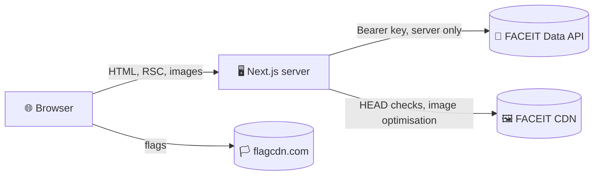

# 🛡️ Security

## 🗺️ Trust boundaries

The browser never talks to the FACEIT API. It receives prerendered pages, optimised images from `/_next/image` and flag images from flagcdn.com.

## 🔑 The API key

| Measure                    | How                                                                                                      |
| -------------------------- | -------------------------------------------------------------------------------------------------------- |
| 🗄️ Stored outside the code | Only in `.env` locally and in the hosting provider's environment variables                               |
| 🙈 Never committed         | `.gitignore` ignores every `.env*` file except `.env.example`                                            |
| 🔒 Server only             | `src/features/squad/api/client.ts` imports `server-only`, so bundling it for the browser fails the build |
| 🤐 Never logged            | Logs mention nicknames, statuses and error kinds, never the key                                          |
| 🚫 Never exposed           | No variable uses the `NEXT_PUBLIC_` prefix                                                               |

> [!CAUTION]
> If a key leaks, revoke it in the FACEIT developer portal right away and replace it in the environment. Use a **server-side** key only.

## 🧱 HTTP headers

Set for every route in `next.config.ts`:

| Header                          | Value                                                                                                                                                                                 |
| ------------------------------- | ------------------------------------------------------------------------------------------------------------------------------------------------------------------------------------- |
| 🧱 `Content-Security-Policy`    | `default-src 'self'`; images from self, FACEIT's CDN and flagcdn.com; no objects; no framing; `base-uri` and `form-action` limited to self; `upgrade-insecure-requests` in production |
| 🖼️ `X-Frame-Options`            | `DENY`                                                                                                                                                                                |
| 📄 `X-Content-Type-Options`     | `nosniff`                                                                                                                                                                             |
| 🔗 `Referrer-Policy`            | `strict-origin-when-cross-origin`                                                                                                                                                     |
| 🪟 `Cross-Origin-Opener-Policy` | `same-origin`                                                                                                                                                                         |
| 🔒 `Strict-Transport-Security`  | `max-age=31536000` in production, so browsers only use HTTPS for a year after the first visit                                                                                         |
| 🎛️ `Permissions-Policy`         | Camera, microphone, geolocation, payment, USB and topics switched off                                                                                                                 |

`X-Powered-By` is removed. Scripts are allowed inline because static pages cannot carry per-request nonces; the only inline scripts are Next.js's own payload, the boot script (theme, dates and the browser colour), the language script of the 404 page and JSON-LD data.

> [!NOTE]
> The end-to-end test `e2e/security.spec.ts` checks the headers of a real response and browses three pages in three languages without a single console error or `securitypolicyviolation` event.

> [!WARNING]
> Because `'unsafe-inline'` is allowed for scripts, never put data from the address or from FACEIT into an inline script as code. JSON-LD goes through `serializeJsonLd()`, which escapes `<`, and everything else is rendered by React as text.

## ✅ Validating FACEIT data

FACEIT responses are treated as untrusted input:

- 🧪 The client returns `unknown`, and the parser reads each field through guards; a malformed response becomes empty values instead of an exception or a crash.
- 🖼️ Image URLs are accepted only over HTTPS from `distribution.faceit-cdn.net` and `assets.faceit-cdn.net`; anything else falls back to the player's initial.
- 🌍 Country codes must be two letters, Steam ids must be digits.
- 🔤 Nicknames and map names are rendered by React as text, never as HTML.
- 🧩 JSON-LD is serialised with `<` escaped, so data cannot close the script tag.
- 🔗 External links use `rel="noopener noreferrer"`.

## 🚦 Protecting the API quota

- 🗄️ FACEIT is called only while a page is rendered or regenerated, never because of a client request.
- 🙅 Unknown nicknames in the address are answered by the proxy from `FACEIT_PLAYERS` with a 404, before any page renders and without contacting FACEIT.
- 🗃️ FACEIT responses are kept in the data cache for four minutes and shared by every page, language and share image.
- 🚥 The client stays under the rate limit and backs off when FACEIT asks it to.

## 🍪 Cookies and privacy

- 🌍 The only cookie is `locale`, set when a visitor picks a language: first party, `SameSite=Lax`, one year, and it holds nothing but a two-letter language code.
- 🌗 The theme lives in `localStorage` and never leaves the browser.
- 🙈 No analytics, no tracking and no third-party scripts. The only third-party requests are flag images from flagcdn.com, sent with `referrerpolicy="no-referrer"`.

## 🔗 Supply chain and CI

| Measure                  | Where                                                                                            |
| ------------------------ | ------------------------------------------------------------------------------------------------ |
| 🔏 Registry signatures   | `npm audit signatures` in CI                                                                     |
| 🛡️ Dependency review     | Pull requests fail on new dependencies with high-severity advisories                             |
| 🔬 CodeQL                | `security-extended` queries for TypeScript and the workflows, weekly and on every change         |
| 🤖 Dependabot            | Weekly grouped updates for npm and GitHub Actions                                                |
| 🔐 Least privilege       | Workflows run with `contents: read` and checkout without persisted credentials                   |
| 📦 Reproducible installs | `npm ci` from the committed lockfile                                                             |
| 🧾 Install scripts       | npm only runs dependency install scripts listed in `allowScripts`; both existing ones are denied |
| 🎭 No secrets in tests   | The end-to-end tests run against a local mock API with a dummy key, bound to `127.0.0.1`         |

## ☑️ Checklist for contributors

- [ ] 🔑 No secret or key in code, tests, fixtures or screenshots
- [ ] 🧪 New FACEIT fields are read through the guards in `parse.ts`
- [ ] 🖼️ New image hosts are added to both `next.config.ts` and the parser's allowlist
- [ ] 🧱 New external resources are added to the Content Security Policy
- [ ] 🔗 New external links open with `rel="noopener noreferrer"`
- [ ] 🌍 Translations stay plain text; elements go into sentences through `rich()`, never through HTML strings

Report vulnerabilities privately as described in the [security policy](../.github/SECURITY.md).
