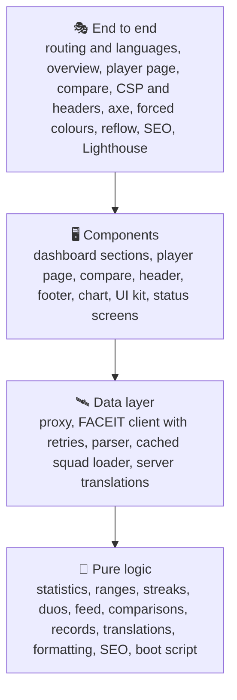
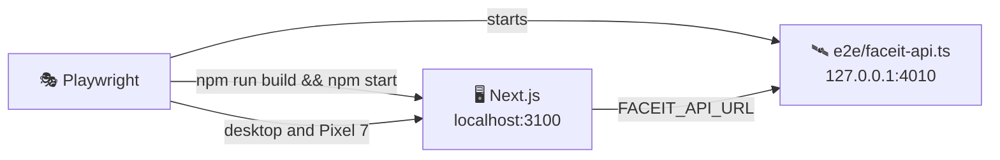

# 🧪 Testing

## 🧰 Stack

| Tool                            | Role                                                        |
| ------------------------------- | ----------------------------------------------------------- |
| ⚡ Vitest 5                     | Unit and component tests, configured in `vitest.config.mts` |
| 🌐 jsdom                        | Browser-like environment for component tests                |
| 🐙 Testing Library + user-event | Rendering components and simulating real interactions       |
| 🧩 jest-dom                     | Readable DOM assertions such as `toBeChecked()`             |
| 📊 `@vitest/coverage-v8`        | Coverage reports and thresholds                             |
| 🎭 Playwright                   | End-to-end tests in Chromium on desktop and phone screens   |
| ♿ axe-core                     | Accessibility checks inside the end-to-end tests            |
| 🚦 Lighthouse                   | Performance, accessibility, best practices and SEO budget   |

## ▶️ Running tests

| Command                 | Mode                                                                          |
| ----------------------- | ----------------------------------------------------------------------------- |
| `npm test`              | 👁️ Unit tests in watch mode                                                   |
| `npm run test:run`      | 🧪 Unit tests, single run                                                     |
| `npm run test:coverage` | 📊 Unit tests with coverage and thresholds                                    |
| `npm run test:e2e`      | 🎭 Production build against the mock API, then Playwright, axe and Lighthouse |

The HTML coverage report is written to `coverage/index.html`, the Playwright report to `playwright-report/`; open the latter with `npx playwright show-report`.

> [!IMPORTANT]
> Install the browser for the end-to-end tests once with `npx playwright install chromium`.

## 🔺 Shape of the suite

Most behaviour is pinned down by fast tests of pure functions. Component tests render whole sections with a small sample squad and use them the way a visitor would. The end-to-end tests check what only a real browser and server can: redirects, status codes, hydration, the inline scripts, layout on a phone and accessibility of the finished pages.

## 📁 Where unit tests live

Tests sit next to the code they cover as `*.test.ts(x)`:

| Area           | Files                                                                  | Covers                                                                                                                                                            |
| -------------- | ---------------------------------------------------------------------- | ----------------------------------------------------------------------------------------------------------------------------------------------------------------- |
| 🚦 Proxy       | `src/proxy.test.ts`                                                    | Redirects to the browser or saved language, lowercase languages, canonical nicknames, 404 rewrites                                                                |
| 🛰️ FACEIT      | `features/squad/api/client.test.ts`, `parse.test.ts`, `loader.test.ts` | Headers, 404s, rejected keys, retries with backoff, parsing every response, missing configuration, dead avatars, outages during builds and in production          |
| 🧮 Squad logic | `features/squad/model/*.test.ts`                                       | Averages and ranks (ELO for every player), day and match ranges, streaks, lineups and duos, levels, maps, nicknames and configuration                             |
| 📊 Overview    | `features/dashboard/**/*.test.ts(x)`                                   | Every section, sorting the leaderboard with inactive players last, the feed, records, the map pool and its pale small samples, rankings, the range in the address |
| 👤 Player page | `features/player/**/*.test.ts(x)`                                      | The per-range context, current form, the trend metric, filtering the match history, teammates, lifetime meters, map cards, empty states                           |
| ⚔️ Compare     | `features/compare/**/*.test.ts(x)`                                     | Shared matches, the default pair, the pair from the address, swapping, the leader of each row                                                                     |
| 🔎 SEO         | `features/seo/**/*.test.ts(x)`                                         | Structured data, social metadata in every language, escaped JSON-LD                                                                                               |
| 🧱 Widgets     | `widgets/Header/*.test.tsx`, `widgets/Footer/*.test.tsx`               | Navigation and the current page, the language menu and the saved choice, the theme switch and its browser colour, credits                                         |
| 🌍 Languages   | `shared/i18n/*.test.ts`                                                | Every key, plural form and placeholder in every language, number parameters, `Accept-Language`, loading catalogs on the server                                    |
| 🧰 Shared      | `shared/lib/*.test.ts`, `shared/ui/*.test.tsx`                         | Formatting, scales, the inline boot script, the line chart, radio groups, avatars, notices, loading states                                                        |

## 🌐 Test environment

`src/test/setup.ts` prepares jsdom:

- 🧩 jest-dom matchers are registered.
- 🔗 `next/link` and `next/image` are replaced with plain `a` and `img` elements, and `usePathname()` reads the jsdom address, so components render without a Next.js router.
- 🧹 After every test the DOM is unmounted, the address is reset to `/en`, `localStorage` is cleared and the theme attribute is removed.

`vitest.config.mts` only collects `src/**/*.test.{ts,tsx}`, maps `@/` to `src/` and replaces `server-only` with an empty module, so server code can be tested directly.

> [!NOTE]
> A few Next.js modules only work inside a Next.js build. Tests replace them with `vi.mock`: `next/cache` for `cacheLife` in the loader and the footer, and `next/root-params` for the language of the current route.

## 🛠️ Helpers

| Helper                               | File                    | Purpose                                                       |
| ------------------------------------ | ----------------------- | ------------------------------------------------------------- |
| `renderWithI18n(ui, locale)`         | `src/test/render.tsx`   | Renders a component inside `I18nProvider` in any language     |
| `i18nFor(locale)`, `CATALOG`         | `src/test/render.tsx`   | The translator and formatter of a language, and every catalog |
| `makeMatch()`, `makePlayer()`        | `src/test/factories.ts` | Consistent matches and players with unique ids                |
| `newestFirst()`                      | `src/test/factories.ts` | Sorts matches the way FACEIT returns them                     |
| `sampleSquad()`                      | `src/test/squad.ts`     | Three players with shared matches, lifetime data and an ace   |
| `PROFILE`, `matchItem()`, `LIFETIME` | `src/test/faceit.ts`    | Responses shaped like the real FACEIT Data API                |

## 🎭 End-to-end tests

`playwright.config.ts` starts two servers before the tests:

1. 🛰️ **The mock FACEIT API** (`e2e/faceit-api.ts`), a dependency-free Node server that answers the four endpoints the client uses. It generates the same squad on every run from a seeded random generator: four players (`anna`, `Bohdan`, `chris`, `dana`) with 55 to 76 matches each over the last two months, duos, trios, matches between squad members, an ace and a player without lifetime statistics. Match times are relative to the start of the server, so day ranges always have matches.
2. 🖥️ **A production build** of the app with `FACEIT_API_URL` pointing at the mock, served on port 3100.

> [!TIP]
> Locally both servers are reused when they are already running, so after the first run a repeated `npx playwright test e2e/accessibility.spec.ts` takes seconds. Start them yourself with the same environment as in `playwright.config.ts` to keep them between runs.

| Spec                       | Checks                                                                                                                                                |
| -------------------------- | ----------------------------------------------------------------------------------------------------------------------------------------------------- |
| 🧭 `routing.spec.ts`       | Redirect to the browser language, the saved language winning, lowercase languages, filters kept, nickname case fixed, translated 404s with status 404 |
| 🧑‍🤝‍🧑 `dashboard.spec.ts`     | The squad, day ranges in the address and after a reload, the theme and its browser colour, switching languages, the feed, player links                |
| 👤 `player.spec.ts`        | Filtering the history, links to FACEIT and to the comparison, the empty lifetime state                                                                |
| ⚔️ `compare.spec.ts`       | Picking, swapping and reloading a pair, shared matches with match rooms                                                                               |
| ♿ `accessibility.spec.ts` | axe on seven pages in four languages, the dark theme, the 404 page, forced colours mode and no sideways scrolling at 320 px                           |
| 🛡️ `security.spec.ts`      | No console errors or CSP violations while browsing three pages in three languages, and every security header in place                                 |
| 🔎 `seo.spec.ts`           | Canonical and `hreflang` links, `og:locale`, JSON-LD, the sitemap and share images per language                                                       |
| 🚦 `lighthouse.spec.ts`    | The Lighthouse budget below                                                                                                                           |

Every spec except SEO and Lighthouse runs twice: in **Desktop Chrome** and on a **Pixel 7** screen. Flag images are answered by a local stub (`stubFlags()` in `e2e/helpers.ts`), so the tests never depend on another site. The accessibility checks run with reduced motion, so transitions never catch axe halfway, and they also enable axe's `label-content-name-mismatch` rule, so a visible label always matches what voice control users say.

### 🚦 Lighthouse budget

`lighthouse.spec.ts` runs after the other projects, one page at a time, in a fresh Chromium:

| Page                  | Form factor | Performance | Accessibility | Best practices | SEO | Page weight |
| --------------------- | ----------- | ----------: | ------------: | -------------: | --: | ----------: |
| 🧑‍🤝‍🧑 `/en`              | 🖥️ Desktop  |      ≥ 0.90 |             1 |              1 |   1 |    ≤ 400 KB |
| 🧑‍🤝‍🧑 `/en`              | 📱 Mobile   |      ≥ 0.80 |             1 |              1 |   1 |    ≤ 400 KB |
| 👤 `/uk/players/anna` | 🖥️ Desktop  |      ≥ 0.90 |             1 |              1 |   1 |    ≤ 400 KB |
| ⚔️ `/pl/compare`      | 🖥️ Desktop  |      ≥ 0.90 |             1 |              1 |   1 |    ≤ 450 KB |

Every audit of the accessibility category must pass as well, including the ones Lighthouse does not weigh into the score. Each run attaches the full Lighthouse HTML report to its test in the Playwright report, so a failed budget can be inspected in CI.

> [!NOTE]
> Locally the pages score 0.98 to 1 for performance and 1 everywhere else; the thresholds leave room for slower CI machines.

## 📐 Conventions

- 🎯 Query by role and accessible name, for example `getByRole("button", { name: /^K\/D/ })`. If an element is hard to find this way, it is hard to use with a screen reader too.
- 🖱️ Drive the UI with `userEvent`; use `fireEvent` only for things user-event cannot express, such as moving a range input. In Playwright, choose styled radio buttons through their label with `option(page, name)` from `e2e/helpers.ts`.
- 👀 Test behaviour, not implementation: assert on what a visitor sees, the address or stored values.
- 🌍 Assert on English texts by default and add a check in another language where wording or formatting differs.
- 🌐 Never call the real FACEIT API: stub `fetch` with `vi.stubGlobal` and typed `vi.fn<Fetch>()` mocks in unit tests, and use the mock server in end-to-end tests.
- ⏱️ Retries and backoff run on fake timers; `vi.runAllTimersAsync()` settles them instantly.
- 🔧 Environment variables are set with `vi.stubEnv` and restored automatically.

## 📊 Coverage

`npm run test:coverage` fails below these thresholds:

| Metric        | Threshold |
| ------------- | --------: |
| 📄 Statements |      95 % |
| 🔀 Branches   |      85 % |
| 🧩 Functions  |      95 % |
| 📏 Lines      |      95 % |

The suite currently covers about 97 % of statements and 87 % of branches. Routes in `src/app`, the image generators in `src/features/seo/og` and the test helpers are excluded, because the end-to-end tests and the production build cover them. CI publishes a coverage summary and uploads the HTML coverage and Playwright reports.
